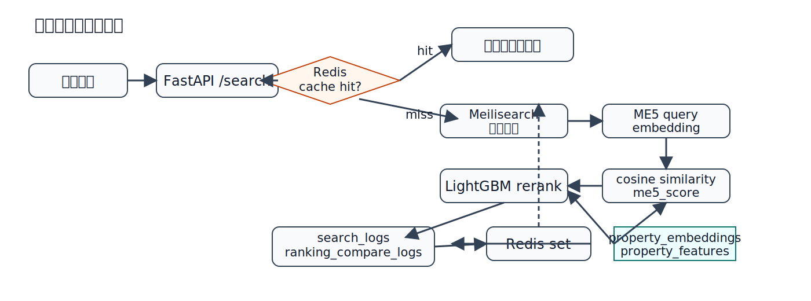
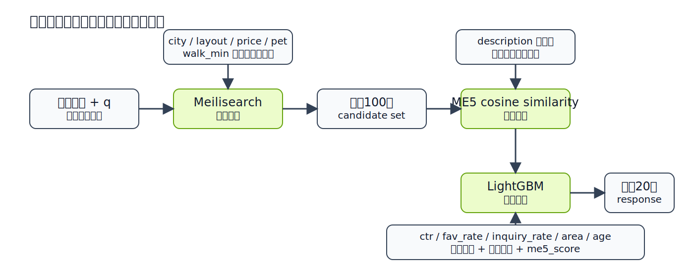
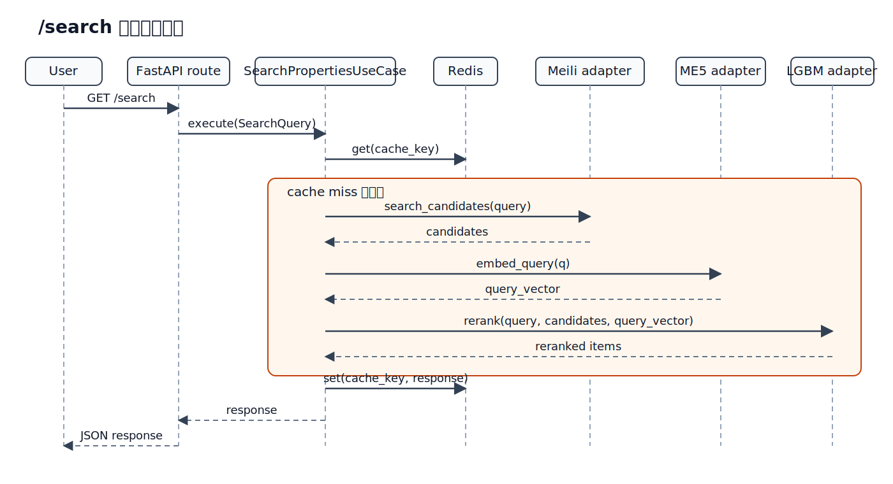

# ハイブリッド検索入門

**対象**
`/home/ubuntu/repos/ML/ml-pipeline/docs/機械学習入門` 受講済みの IT エンジニア

**この動画で扱うこと**
- このプロジェクトのハイブリッド検索の仕様
- 実コードでの処理フロー
- 学習済みモデルを使った再ランキングの見方

---

## 前提とゴール

### 前提
- 機械学習の基本用語は既知
- 「モデル」「特徴量」「推論」は説明済み

### この動画のゴール
1. `Meilisearch + ME5 + LightGBM` の役割分担を理解する
2. `/search` がどの順で処理されるか追えるようになる
3. 改善ポイントをコードベースで考えられるようになる

> ここでは ML の基礎復習ではなく、検索実装の読み解きに集中します。

---

## 仕様上の位置付け

**docs/01_仕様と設計.md の要点**

| レイヤ | 技術 | この動画で見る役割 |
|---|---|---|
| API | FastAPI | `/search` の入口 |
| 検索 | Meilisearch | 候補集合の高速取得 |
| Embedding | multilingual-e5-large | クエリ意味ベクトル化 |
| Ranking | LightGBM | 最終順位の最適化 |
| Cache | Redis | 同一条件の応答短縮 |
| DB | PostgreSQL | 特徴量・埋め込み・ログ保存 |

**狙い**
- キーワード一致だけでは拾えない検索意図を補う
- ただし全文検索の速さは落とさない

---

## 全体アーキテクチャ



> 候補取得、意味類似度、再ランキング、ログ保存が別段でつながる構成です。

---

## なぜハイブリッド検索か

### キーワード検索だけだと弱い点
- 表記ゆれ
- 曖昧な希望条件
- 説明文の意味一致

### ベクトル検索だけだと弱い点
- 厳密な条件絞り込み
- 価格や徒歩分などの構造化条件
- レスポンスの安定性

### この実装の考え方
1. `Meilisearch` で速く候補を絞る
2. `ME5` で意味類似度を足す
3. `LightGBM` で最終順位を決める

---

## 何と何のハイブリッドか

この実装では、2 つの層でハイブリッドにしています。

| 層 | 組み合わせ | 役割 |
|---|---|---|
| 候補取得 | `全文検索 + 条件フィルタ` | 速く候補を集める |
| 並び替え | `意味類似度 + 行動特徴 + 物件属性` | より良い順に並べる |

### それぞれの強み
- `Meilisearch`: 高速、厳密条件に強い、実装が単純
- `Embedding`: 曖昧語、言い換え、説明文の意味に強い
- `LightGBM`: 複数特徴をまとめて最終順位に落とし込める

> 「lexical と vector のハイブリッド」だけでなく、最終的には ML rerank まで含めた構成です。

---

## 候補取得と再ランキングの役割分担



> 候補取得では厳密条件を、再ランキングでは意味と行動特徴を見ています。

---

## ワードベクトル / Embedding とは

### 最低限のイメージ
- 単語や文を、数百次元の数値ベクトルに変換したもの
- 意味が近い文ほど、ベクトル空間でも近くなる
- 完全一致しない語でも「近さ」で比較できる

### この検索で嬉しいこと
- `静かな住宅街` と `閑静なエリア`
- `広い部屋` と `ゆとりのある間取り`
- `駅近` と `徒歩数分`

> キーワード一致しなくても、意味が近ければ拾いやすくなります。

---

## Embedding の手順

この実装では、物件側とクエリ側で手順が分かれます。

### 物件側
1. 物件情報から説明文テキストを組み立てる
2. `encode_passages()` で passage embedding を作る
3. `property_embeddings` テーブルへ保存する

### クエリ側
1. ユーザーの `q` を受け取る
2. `encode_queries()` で query embedding を作る
3. 候補物件の embedding と cosine similarity を計算する

### 最後
- その類似度を `me5_score` として LightGBM に渡す

---

## 物件 Embedding の作り方

`src/jobs/embeddings/generate_property_embeddings.py`

```python
passages = [build_passage(row) for row in rows]
vectors = encode_passages(passages)
return upsert_property_embeddings(records)
```

### ポイント
- 物件説明文はオンラインではなく事前計算
- `title`, `description`, `city`, `layout`, `price` などをまとめて 1 文書化
- 作ったベクトルは `property_embeddings` に保存

> 重い処理を先に済ませることで、検索時はクエリ側だけをベクトル化します。

---

## クエリ Embedding の作り方

`src/services/embeddings/me5_embedding_service.py`

```python
def encode_queries(queries):
    texts = [f"query: {q}" for q in queries]
    return get_embedder().encode(texts)

def encode_passages(passages):
    texts = [f"passage: {p}" for p in passages]
    return get_embedder().encode(texts)
```

### 重要
- query と passage で prefix を分けている
- E5 系モデルの想定入力に合わせた作り
- 検索クエリと物件文書を別モードで埋め込んでいる

---

## 検索 API の入力

`src/api/schemas.py`

```python
class SearchParams(BaseModel):
    q: str = ""
    city: str | None = None
    layout: str | None = None
    price_lte: int | None = None
    pet: bool | None = None
    walk_min: int | None = None
    limit: int = 20
    candidate_limit: int = 100
```

**見方**
- `limit`: 最終返却件数
- `candidate_limit`: 再ランキング前の候補件数

> ハイブリッド検索では「何件集めてから並べ替えるか」が重要です。

---

## エンドツーエンドの処理順

`src/application/usecases/search_properties.py`

```python
cache -> candidates -> query_vector -> rerank -> log -> cache
```

### 実際の順序
1. Redis キャッシュ確認
2. Meilisearch で候補取得
3. `q` があればクエリ embedding 作成
4. 候補ごとに `me5_score` を計算
5. LightGBM で再ランキング
6. 検索ログと比較ログを保存
7. レスポンスを再度キャッシュ

---

## `/search` のシーケンス



> キャッシュヒット時とミス時で、後続の処理量が変わります。

---

## Step 1: 候補検索

`src/adapters/outbound/search/meilisearch_property_search_adapter.py`

```python
payload = build_search_payload(
    q=query.q,
    city=query.city,
    layout=query.layout,
    price_lte=query.price_lte,
    pet=query.pet,
    walk_min=query.walk_min,
    candidate_limit=query.candidate_limit,
)
```

### ポイント
- キーワードと構造化条件を同時に扱う
- ここではまだ最終順位を決めない
- 役割はあくまで「候補100件の抽出」

---

## Step 1 の中身: フィルタ構築

`src/services/search/query_filter_builder.py`

```python
if city:
    filters.append(f"city = {_quote(city)}")
if price_lte is not None:
    filters.append(f"price <= {price_lte}")
if walk_min is not None:
    filters.append(f"walk_min <= {walk_min}")
```

### 解説
- `q` は全文検索
- `filter` は厳密条件
- つまり lexical search と structured filter の組み合わせ

**例**
`札幌 2LDK` + `price <= 80000` + `pet = true`

---

## Step 2: クエリ埋め込み

`src/adapters/outbound/embeddings/me5_embedding_adapter.py`

```python
def embed_query(self, text: str) -> list[float]:
    if not text.strip():
        return []
    return encode_queries([text])[0]
```

### ここでの設計判断
- `q` が空なら embedding を作らない
- その場合、意味類似度は `0.0`
- 条件検索だけでもシステムは動く

> 「ベクトル検索が必須」ではなく、「必要なときだけ意味情報を足す」設計です。

---

## Step 2.5: 類似度の計算

`src/services/embeddings/similarity_service.py`

```python
dot = sum(a[i] * b[i] for i in range(len(a)))
return float(dot / (norm_a * norm_b))
```

### 何をしているか
- クエリベクトルと物件ベクトルの角度の近さを測る
- 値はおおむね `-1` から `1`
- この実装では、近いほど高スコアとして `me5_score` に使う

> Embedding を作るだけでは不十分で、最後は比較関数で近さを数値化します。

---

## Step 3: 候補ごとの意味類似度

`src/adapters/outbound/ranking/lgbm_reranking_adapter.py`

```python
doc_vector = embedding_map.get(int(pid))
score = cosine_similarity(query_vector, doc_vector)
item["me5_score"] = float(round(score, 6))
```

### 何をしているか
- 物件ごとの埋め込みを DB から取得
- クエリベクトルとの cosine similarity を計算
- 候補アイテムに `me5_score` を付与

### 重要
- Meilisearch のスコアを直接使う構成ではない
- 意味類似度は再ランキング特徴量の一つ

---

## Step 4: LightGBM 再ランキング

`src/services/ranking/lgbm_reranker.py`

```python
vector = [
    price,
    walk_min,
    age,
    area,
    ctr,
    fav_rate,
    inquiry_rate,
    me5_score,
]
```

### 再ランキングに使う特徴量
- 物件属性: `price`, `walk_min`, `age`, `area`
- 行動特徴: `ctr`, `fav_rate`, `inquiry_rate`
- 意味特徴: `me5_score`

> ハイブリッド検索の肝は、検索スコアを 1 つに頼らず複数特徴で順位を決める点です。

---

## モデルが無いときのフォールバック

同ファイルではモデル未配置でも処理継続します。

```python
fallback_score = (
    ctr * 0.4
    + fav_rate * 0.2
    + inquiry_rate * 0.2
    + me5_score * 0.2
)
```

### これは何のためか
- 開発初期でも `/search` を壊さない
- 学習前に疎通確認できる
- 段階的に品質を上げられる

### 注意
- 本番品質の順位は学習済みモデル前提

---

## キャッシュ戦略

`SearchPropertiesUseCase._build_cache_key()`

```python
search:q={q}|city={city}|layout={layout}|price_lte={price_lte}
|pet={pet}|walk_min={walk_min}|limit={limit}|candidate_limit={candidate_limit}
```

### 見るべき点
- 検索条件をそのままキー化
- `limit` と `candidate_limit` もキーに含む
- TTL はデフォルト `120` 秒

### 意味
- 同じ条件ならランキング結果ごと再利用
- ただしログ保存はキャッシュヒット時には走らない設計

---

## ログ設計

`search_properties.py` では 2 種類のログを保存します。

| ログ | 内容 | 用途 |
|---|---|---|
| `search_logs` | 最終結果と `me5_score` | 検索履歴の保存 |
| `ranking_compare_logs` | Meili 順と rerank 後順 | オフライン比較 |

### 動画で強調したい点
- ただ検索を返すだけで終わらない
- 後で学習改善に使う比較データを残している

---

## この実装での「ハイブリッド」

### 1. 候補取得のハイブリッド
- `q` による全文検索
- `city / layout / price / pet / walk_min` の条件絞り込み

### 2. スコアリングのハイブリッド
- 意味類似度 `me5_score`
- 行動指標 `ctr / fav_rate / inquiry_rate`
- 物件属性 `price / walk_min / area / age`

### 3. システム設計のハイブリッド
- 高速検索エンジン
- ML モデル
- キャッシュ
- ログ蓄積

### つまり
- `Meilisearch` 単独ではない
- `Embedding` 単独でもない
- `keyword retrieval + semantic similarity + learned rerank` の三段構成

---

## 典型ユースケース

**例**
`静かな住宅街 2LDK`、`city=札幌`、`pet=true`

### 期待する挙動
- Meili が `札幌` と `2LDK` と `pet=true` で候補を絞る
- ME5 が「静かな住宅街」に近い説明文を持つ物件を上げる
- LightGBM が人気や問い合わせ率も見て順序を最適化する

> 条件一致、意味一致、事業KPI寄りの順位最適化を分担しています。

---

## デモで見るべき観点

### 画面で確認したいもの
1. `/search` のクエリパラメータ
2. `candidate_limit=100` と `limit=20` の違い
3. レスポンス中の `me5_score`
4. `search_log_id` と `compare_log_id`

### コードで確認したいもの
- `search_properties.py`
- `lgbm_reranking_adapter.py`
- `lgbm_reranker.py`

---

## 改善ポイントの考え方

### まず疑う場所
- 候補が足りない: Meili 側の recall
- 並びが悪い: LightGBM の特徴量や学習データ
- 曖昧語に弱い: embedding の品質や説明文整備
- 応答が遅い: `candidate_limit` と DB 取得コスト

### 追加しやすい拡張
- Meili スコアの特徴量化
- popularity score の活用
- feedback を使った再学習

---

## まとめ

### このプロジェクトのハイブリッド検索
1. Meilisearch で候補を高速抽出
2. ME5 で意味類似度を追加
3. LightGBM で事業指標込みの最終順位化

### 重要な見方
- 検索は 1 つのアルゴリズムで完結しない
- 「候補取得」と「順位最適化」を分けて考える
- ログ設計まで含めて検索品質を改善する

---

## 次の一歩

- `docs/01_仕様と設計.md` と見比べて役割分担を確認する
- `src/application/usecases/search_properties.py` を読む
- `property_features` と `property_embeddings` の生成元を追う
- デモでログがどう残るか確認する

> 次回は、ランキング学習データの作り方と評価設計に進めます。
