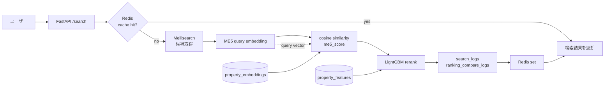
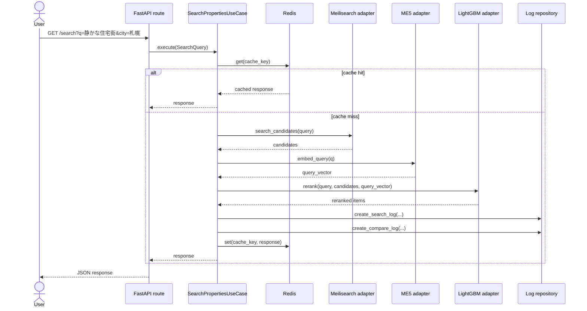
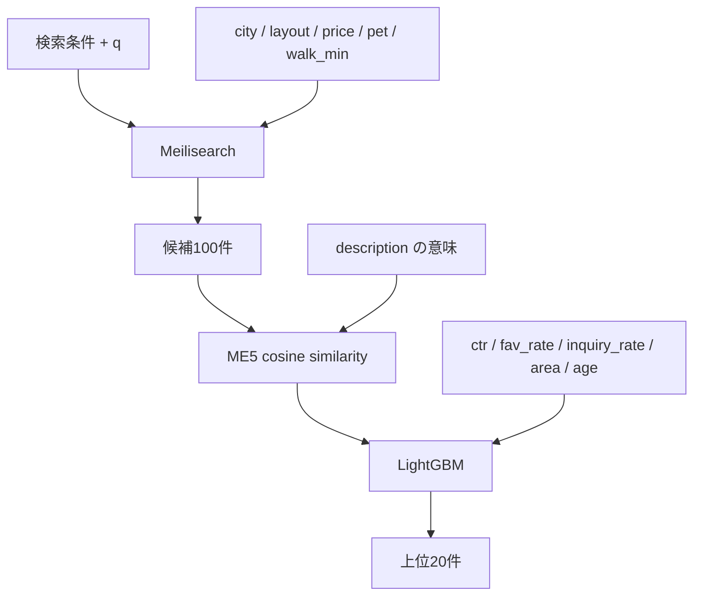
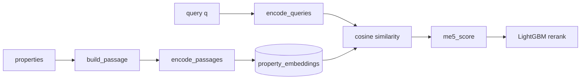
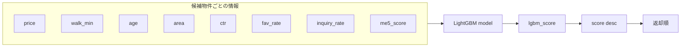
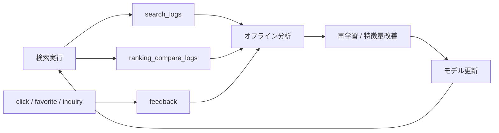
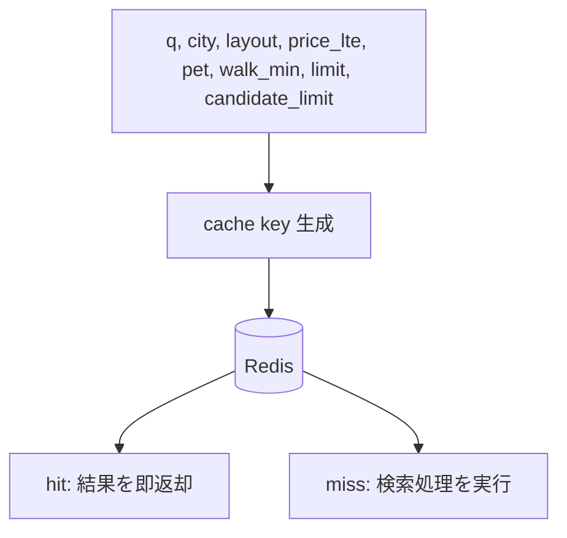

# 図解（Mermaid）

動画・スライドで使うハイブリッド検索の図です。  
Mermaid Live Editor か `mmdc` で PNG / SVG に書き出す想定です。

---

## Diagram 1: 全体アーキテクチャ



**用途:** 最初の全体像説明。  
**強調点:** 候補取得と再ランキングが別段になっていること。

---

## Diagram 2: `/search` のシーケンス



**用途:** 実コードの主線を説明するとき。  
**強調点:** キャッシュヒット時とミス時の分岐。

---

## Diagram 3: 候補取得と再ランキングの役割分担



**用途:** ハイブリッド検索の概念整理。  
**強調点:** 1 段目と 2 段目で見ている情報が違うこと。

---

## Diagram 4: Embedding の手順



**用途:** Embedding を重点説明するスライド用。  
**強調点:** 物件側は事前計算、クエリ側はオンライン計算であること。

---

## Diagram 5: 特徴量の合流点



**用途:** `lgbm_reranker.py` の説明。  
**強調点:** `me5_score` は単独ではなく特徴量群の一つ。

---

## Diagram 6: ログと改善ループ



**用途:** 学習システムとしての全体像。  
**強調点:** 検索基盤は返して終わりではなく、改善ループを持つ。

---

## Diagram 7: キャッシュキーの考え方



**用途:** レイテンシとログの話をする補助図。  
**強調点:** `limit` と `candidate_limit` もキーに入る。

---

## 書き出しメモ

```bash
mmdc -i diagram.mmd -o diagram.png -t neutral -b transparent
```

- 背景透過で書き出すとスライドに重ねやすい
- 動画用は 2x 以上の解像度を推奨
