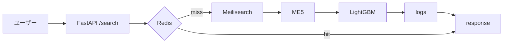
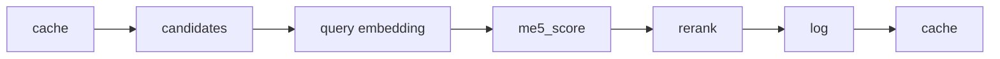
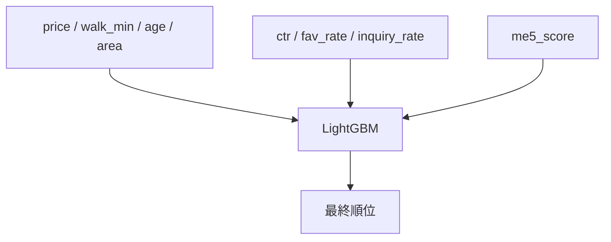

# 図解

詳細版は `../05_図解.md` を参照。  
ここでは撮影時によく使う 3 図だけを抜粋します。

---

## Diagram A: 全体アーキテクチャ

```mermaid
flowchart LR
    U[ユーザー] --> API[FastAPI /search]
    API --> C{Redis}
    C -->|miss| M[Meilisearch]
    M --> E[ME5]
    E --> L[LightGBM]
    L --> LOG[logs]
    LOG --> R[response]
    C -->|hit| R
```

---

## Diagram B: 処理順

```mermaid
flowchart LR
    A[cache] --> B[candidates]
    B --> C[query embedding]
    C --> D[me5_score]
    D --> E[rerank]
    E --> F[log]
    F --> G[cache]
```

---

## Diagram C: 特徴量の合流

```mermaid
flowchart TB
    P[price / walk_min / age / area]
    U[ctr / fav_rate / inquiry_rate]
    S[me5_score]
    P --> LGBM[LightGBM]
    U --> LGBM
    S --> LGBM
    LGBM --> O[最終順位]
```
